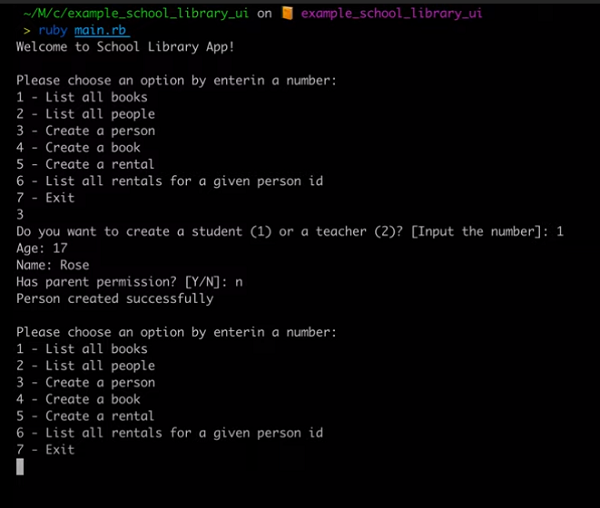
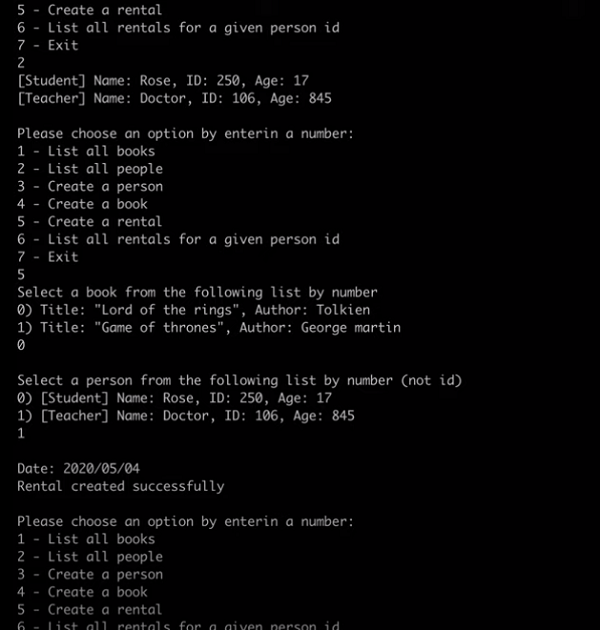

# School library (OOP using)

> In this project we will use OOP to build the a simple librarian app, where should be posibility to add books, users and records about who borrowed a given book and when. 
 

## App functionality:

- Add new students or teachers.
- Add new books.
- Save records of who borrowed a given book and when.

## Milestones:

- Add Person, Student, and Teacher classes. <<<<< we are here
- Decorate a class.
- Set up associations.
- Add basic UI.
- Refactor your code.
- Preserve data.
- Unit tests.

## Built using:

- Ruby

## Getting Started

### Setup
- git clone https://github.com/elmar8287/school_library_oop.git
- cd ./school_library_oop
- `gem install rubocop`

## Author

👤 **Elmar Abdulkarimov**

- GitHub: [Elmar Abdulkarimov](https://github.com/elmar8287)

## 🤝 Contributing

Contributions, issues, and feature requests are welcome!

Feel free to check the [issues page](../../issues/).

## Show your support

Give a ⭐️ if you like this project!

## Acknowledgments

- Hat tip to anyone whose code was used
- Inspiration
- etc

## 📝 License

This project is [MIT](./MIT.md) licensed.
